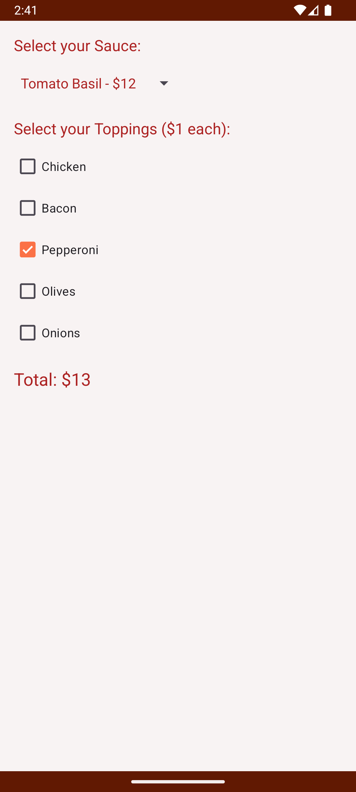

John Entezari:
Did spinner functionality, and the app theme in res/values

Milahd Mansoori:
Did the toppings check boxes, dialogue window, and launcher icon.

The cool UI changes that were made were implemented using a switch declared in the 
main activity xml and when toggled on by the user the MainActivity kt file uses the colors
declared in the colors xml to change the appearance of the main activity with contrasting colors
for a cool dark mode-like appearance. Even the colors of the spinner is changed in dark mode.
