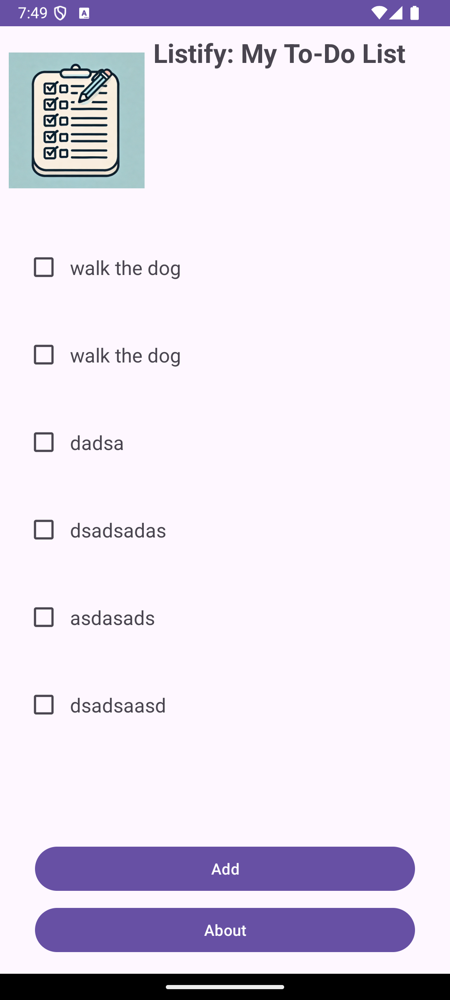
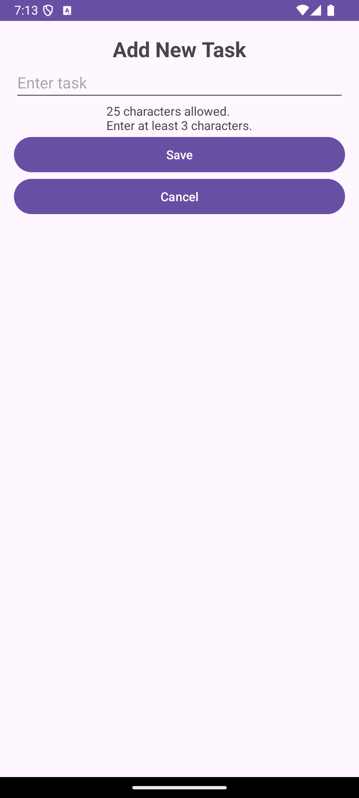
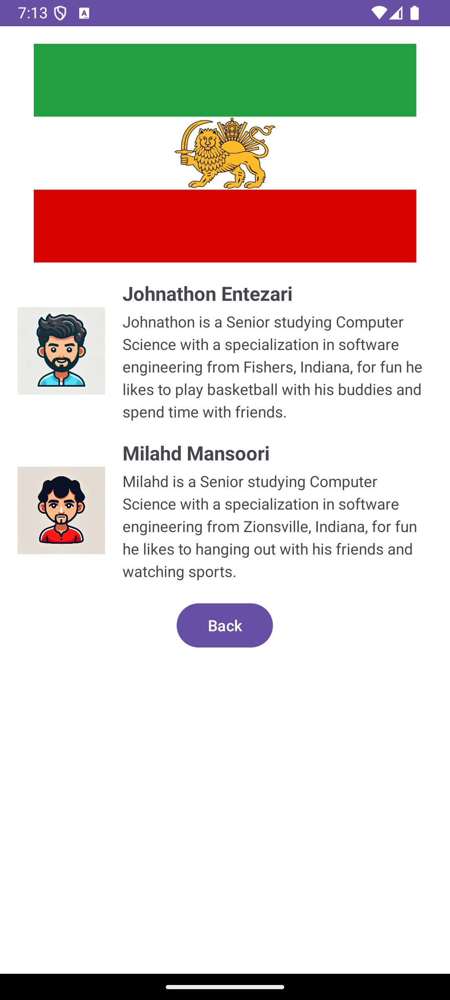

Project Overview
This Android app allows users to manage up to seven daily tasks. Users can add, view, navigate, and mark tasks as complete with a user-friendly interface. Tasks are saved for future sessions, so the last saved tasks appear each time the app is opened.

Features

Milahd's contribution
Task Management:
Add up to seven tasks. If seven tasks are added, the "Add" button changes to "Too much work!".
Tasks are displayed in a RecyclerView without empty slots.
Tasks are securely saved in a firestore database.

Johns Contribution:
Task Details and Actions:
Tap a task to view details and access four action buttons:
Mark as complete: Removes the task from the list.
Cancel: Closes the activity.
Previous Task and Next Task: Navigate through tasks without returning to the home screen.

Both contribution
About Activity:
Provides information about the app and its two developers.
Accessible from the Home Screen.

